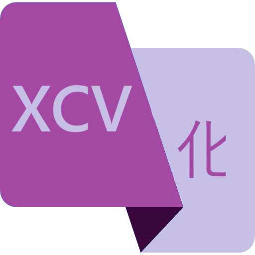

# XCVTransformer

**XCVTransformer** es una herramienta de escritorio desarrollada en C# con WinUI 3 que permite aplicar transformaciones y traducciones sobre el contenido del portapapeles de Windows. El objetivo principal es facilitar tareas comunes como cifrados simples, cambios de formato o traducciones entre idiomas, directamente desde una interfaz sencilla y accesible.

Este proyecto forma parte de un Trabajo Fin de Grado (TFG) en Ingeniería Informática en la Universidad de Oviedo.

  

## Características

- 🔁 Transformaciones de texto (Invertir, ROT13, Base64, Hexadecimal, Morse, etc.)
- 🌍 Traducciones entre varios idiomas usando APIs externas
- 🧠 Detección automática de idioma
- 📋 Monitoreo en segundo plano del portapapeles
- 🖼️ Interfaz tipo Single Window, moderna y minimalista
- 🧪 Tests unitarios incluidos

## Tecnologías usadas

- **Lenguaje:** C#
- **Framework:** WinUI 3 (.NET 6+)
- **Patrón de diseño:** MVVM
- **Tests:** MSTest
- **Otras tecnologías:** Windows App SDK, BouncyCastle (para cifrados), APIs de traducción

## Requisitos

- Windows 10/11 con soporte para aplicaciones WinUI 3
- .NET 6 SDK o superior
- Visual Studio 2022 o superior (con carga de proyectos WinUI habilitada)

## Licencia
Este proyecto se entrega con fines académicos. Para uso o distribución externa, por favor contactar con el autor Pedro Castro Montes.
